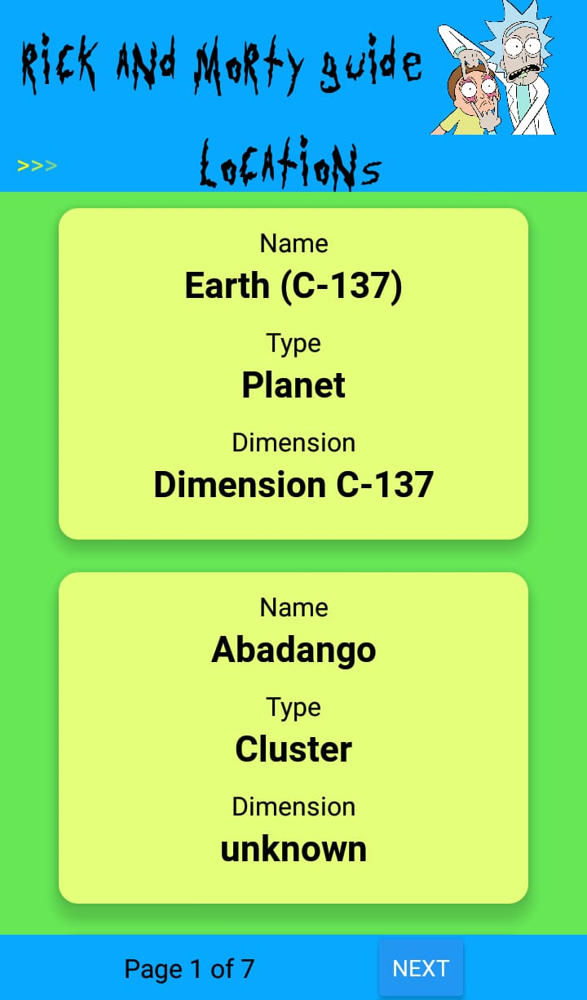
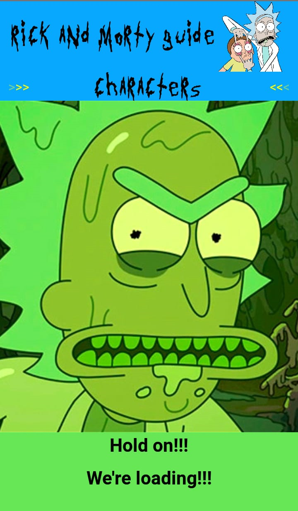
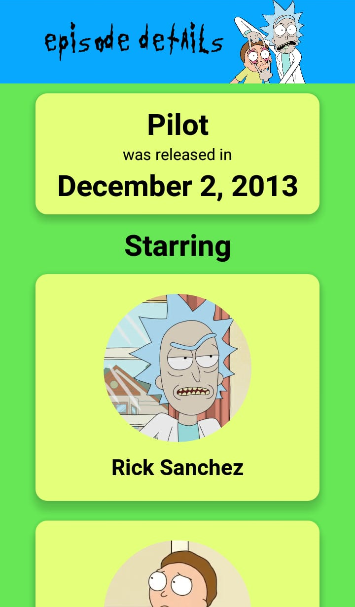
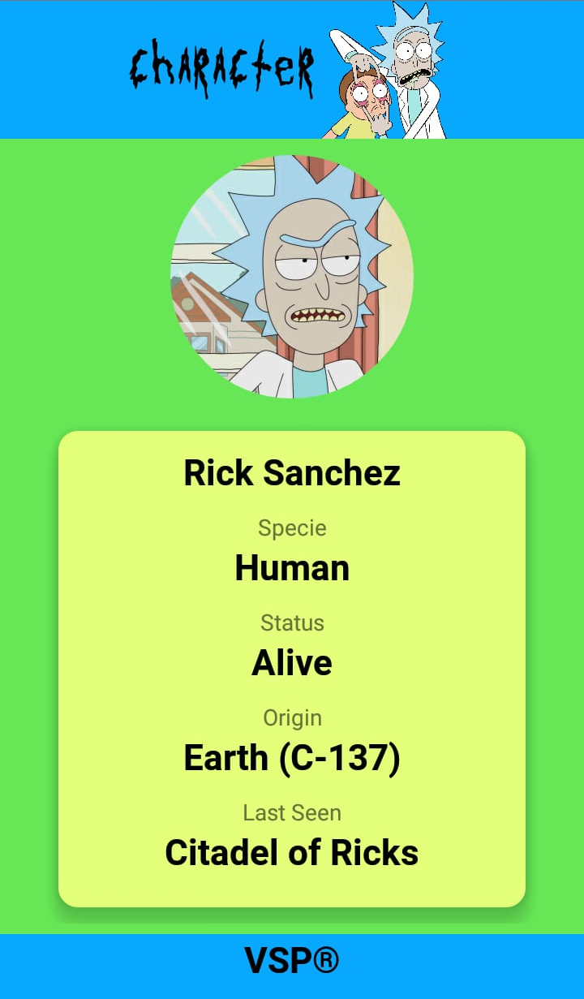
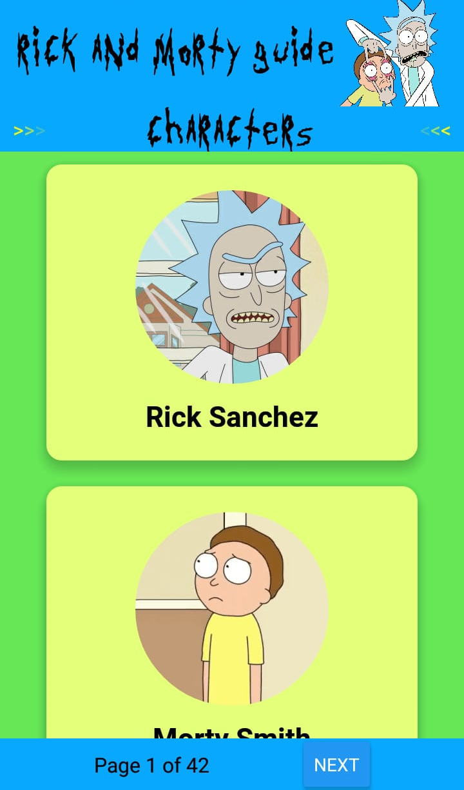
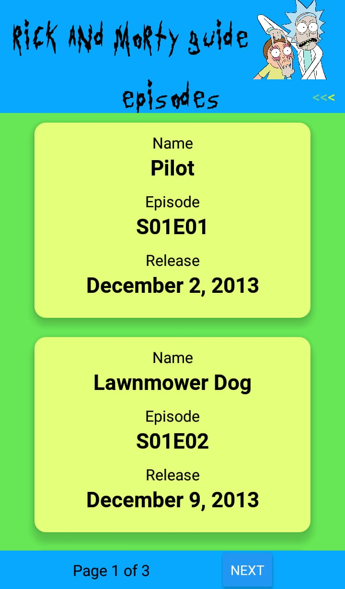

# {VSP}
## Rick and Morty Guide


<div>






</div>


> Desenvolvido para trazer informações de episódios e personagens de Rick and Morty 

> Desenvolvido para Teste de Código


### Requisitos de avaliação

O projeto foi finalizado, adequando os requisitos:

- [x] Listar os episódios
- [x] Transição entre telas
- [x] Detalhes dos episódios
- [x] Detalhes de cada personagem no episódio
- [x] Detalhes dos personagens
- [x] Detalhes dos lugares


## 💻 Pré-requisitos


  Ter React Native CLI
  
  NPM ou YARN
  
  Emulador Mobile ou dispositivo físico
  
 -


## ☕ Usando o Rick and Morty Guide

Para usar:

```
Faça um git clone do projeto e mande instalar as dependências,
utilizando o NPM install
Utilize o comando npm run android ou npm run ios
Será feito o bundler do projeto
Será inicializado no Emulador ou no físico caso esteja plugado via usb
```


## 🤝 Desenvolvido por:

<table>
  <tr>
    <td align="center">
      <a href="#">
        <br>
        <sub>
          <b>Vitor dos Santos Pedra</b>
        </sub>
      </a>
    </td>
  </tr>
</table>


## 🤝 Objetivo:

```
Realizar um teste de habilidades com react Native para um empresa.
```
